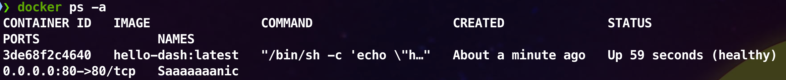

# Just a simple Hello World 
_with Sonic Dash_

Container de testes para você poder validar rapidamente se está tudo funcionando シ

````shell
❯ docker images
REPOSITORY   TAG       IMAGE ID       CREATED       SIZE
hello-dash   latest    1d5244222edc   2 hours ago   1.41MB
````
Usando a imagem acima você pode rodar diretamente:
```shell
docker run -d --rm --name Saaaaaaanic -p 80:80 hello-dash:latest
````
Ele vai subir o container na porta 80, veja:


Se você rodar um curl local:
```shell
curl localhost
````
Vai lhe responder:
````shell
❯ curl localhost
<pre>
   ________              ______
   ___  __ \_____ __________  /_
   __  / / /  __ `/_  ___/_  __ \
   _  /_/ // /_/ /_(__  )_  / / /
   /_____/ \__,_/ /____/ /_/ /_/

   -     =    .--._
   - - ~_=  =~_- = - `.  `-.
 ==~_ = =_  ~ -   =  .-'    `.
--=~_ - ~  == - =   .'      _..:._
---=~ _~  = =-  =   `.  .--.'      `.
--=_-=- ~= _ - =  -  _.'  `.      .--.:
-=_~ -- = =  ~-  .'      :     :    :
-=-_ ~=  = - _-`--.     :  .--:    D
  -=~ _=  =  -~_=  `;  .'.:   ,`---'@
--=_= = ~-   -=   .'  .'  `._ `-.__.'
--== ~_ - =  =-  .'  .'     _.`---'
--=~_= = - = ~  .'--''   .   `-..__.--.
-----==~ _= - ~-=  =-~_-   `-..___(  ===;
--==~_==- =__ ~-=  - -    .'       `---'
</pre>
````

cya! ᕕ( ᐛ )ᕗ